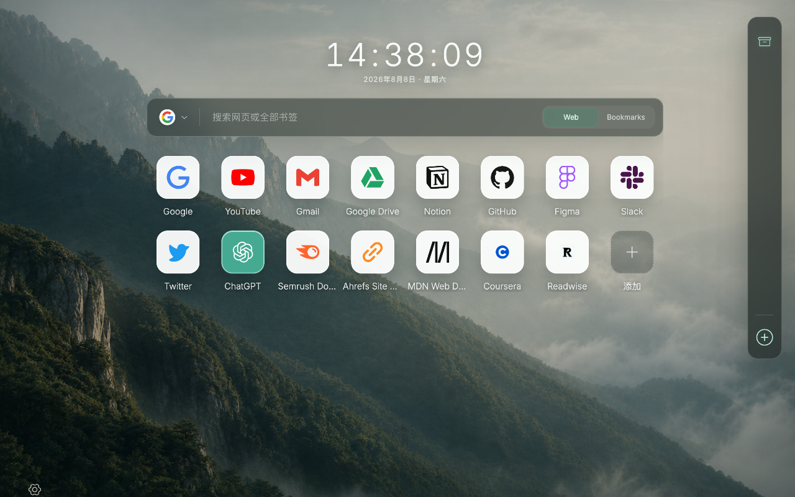
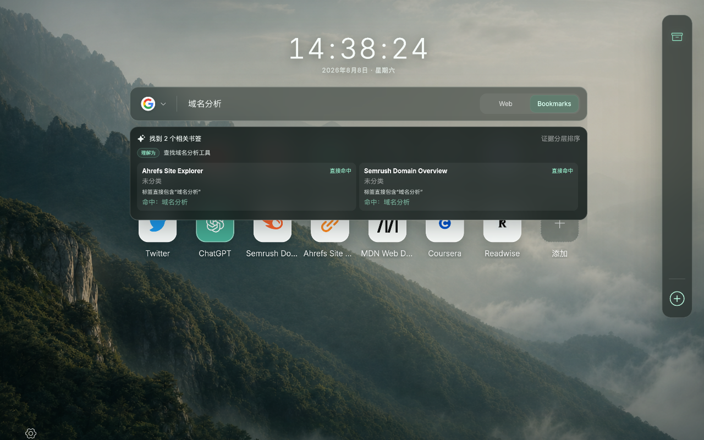
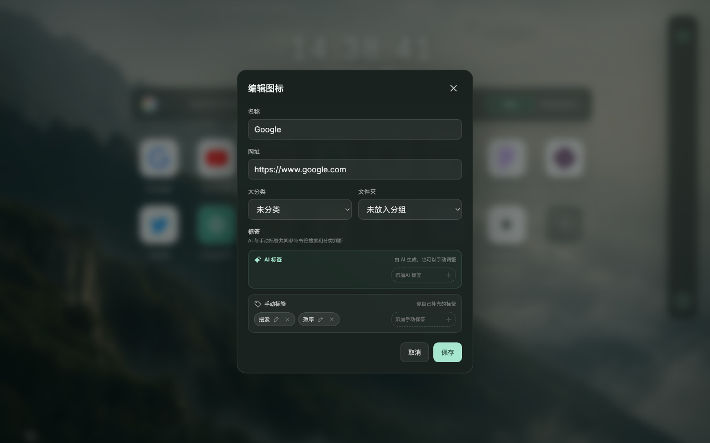
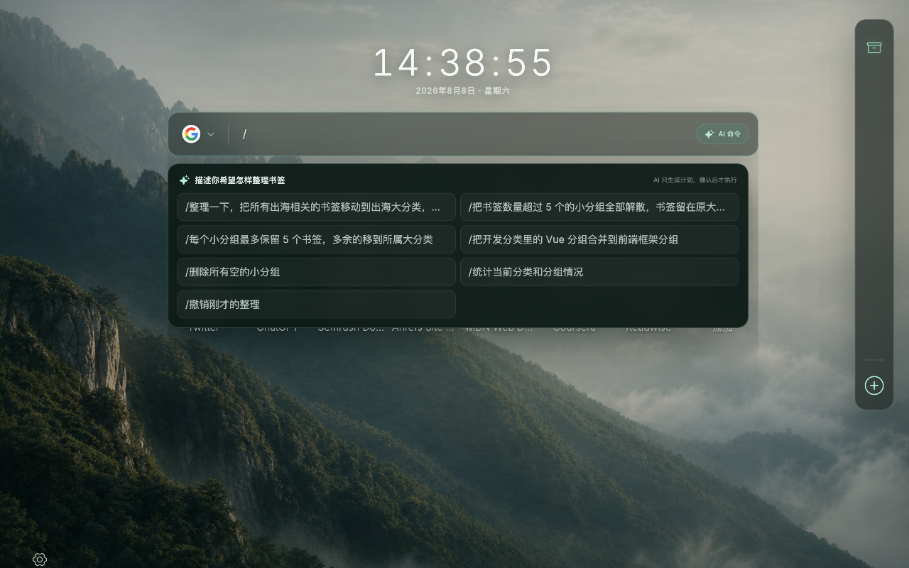
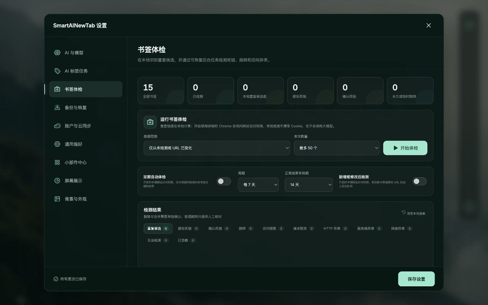

<p align="center">
  
</p>

<h1 align="center">SmartAINewTab</h1>

<p align="center">
  一个本地优先、AI 可选、不会擅自重排原生书签的 Chrome 新标签页。
</p>

<p align="center">
  <a href="https://github.com/zuogl/SmartAINewTab/actions/workflows/ci.yml"></a>
  <a href="LICENSE"></a>
  
</p>

SmartAINewTab 使用 Chrome 原生书签作为数据源，在新标签页中提供分类、分组、图标网格、
统一搜索、AI 整理和书签体检。没有 AI Key、没有云账户时，书签展示、管理和本地搜索仍然
可以正常使用。



## 功能亮点

- **不破坏原生书签**：分类、分组和个性排序保存在独立的 sidecar 布局中，拖拽操作不会
  擅自移动 Chrome 原生书签文件夹。
- **统一搜索入口**：支持 Google、百度、Bing、DuckDuckGo 网页搜索，以及跨全部书签的
  本地搜索和自然语言检索。
- **可选 AI 整理**：通过用户自备的 API Key（BYOK）生成标签、摘要和分类建议；任务支持
  查看进度、取消、重试，并可在 Manifest V3 service worker 重启后继续。
- **完整书签管理**：创建和编辑分类、分组、书签与标签，支持拖拽排序、右键菜单、当前页或
  新标签页打开。
- **书签体检**：检测重复链接、失效链接、访问受限和跳转异常；支持打开验证、复检、忽略、
  删除以及地址修复前预览。
- **备份与恢复**：支持本地 JSON 导入导出；可选云备份在浏览器端加密后再上传，服务端无法
  解密书签内容。
- **个性化新标签页**：提供摄影背景、背景轮播、小组件、时间样式和右侧分类导航。
- **多语言界面**：支持简体中文、繁體中文、English、日本語、한국어以及跟随浏览器。

| 全部书签搜索 | AI 标签与编辑 |
| --- | --- |
|  |  |

| 自然语言命令 | 书签体检 |
| --- | --- |
|  |  |

## 隐私原则

SmartAINewTab 默认在本地处理和保存书签数据。联网功能由用户主动使用或明确开启，并按需
申请对应网站的可选访问权限。

- 不内置任何 AI Provider API Key；API Key 只保存在本机，不进入本地导出或云备份。
- 使用 AI 功能时，只向用户选择的 Provider 发送完成当前任务所需的书签元数据；不发送网页正文。
- 不使用 content script，不注入用户访问的网页，也不申请 `cookies` 权限。
- 页面元数据、favicon 和常规书签体检请求不携带登录 Cookie。
- 云备份是可选功能，备份内容在浏览器中完成端到端加密；恢复密码不会上传，服务端无法代为找回。
- 不出售用户数据，不接入广告或用户画像 SDK。

完整的数据范围、第三方处理者和删除方式请阅读[隐私政策](docs/PRIVACY.md)。

## 从源码安装

### 环境要求

- Chrome 或其他兼容 Manifest V3 的 Chromium 浏览器
- Node.js 22 或更高版本
- npm

### 构建扩展

```bash
git clone https://github.com/zuogl/SmartAINewTab.git
cd SmartAINewTab
npm ci
npm run build
```

构建完成后：

1. 打开 `chrome://extensions`；
2. 开启右上角的“开发者模式”；
3. 点击“加载已解压的扩展程序”；
4. 选择项目中的 `.output/chrome-mv3` 目录；
5. 打开一个新标签页。

> 从源码构建的扩展与未来可能发布的商店版本是独立安装实例，本地数据不会自动共享。

## 本地开发

安装依赖后，可以选择普通浏览器预览或真实扩展环境：

```bash
# 快速预览界面，默认访问 http://localhost:5173
npm run dev

# 在 WXT 扩展开发环境中运行
npm run dev:extension
```

提交改动前运行完整检查：

```bash
npm run check
```

该命令会检查公开仓库边界、背景素材、第三方许可证、TypeScript、测试和 Chrome MV3 构建。
更多开发约定见[贡献指南](CONTRIBUTING.md)。

## 可选 AI Provider

AI 功能采用 BYOK 模式。用户可以在设置中选择预置 Provider，或填写兼容接口的 endpoint、
模型和自己的 API Key。项目不会在源码中提供共享密钥，也不会代理或转售模型额度。

没有配置 Provider 时，以下功能仍然可用：

- 新标签页和原生书签管理；
- 分类、分组、排序与手动标签；
- 基于标题、URL、标签和分类的本地搜索；
- 本地备份与恢复；
- 不依赖 AI 的书签体检和个性化功能。

## 可选云同步

仓库中的 [`worker/`](worker/) 提供基于 Cloudflare Workers、D1 和私有 R2 的自托管同步后端，
用于 Google OAuth、会话管理和加密备份的版本化存储。Worker 不接收 AI Provider API Key，
也无法解密用户备份。

部署前请阅读 [Worker 说明](worker/README.md)。Google OAuth、Cloudflare 资源和生产环境允许列表
需要由部署者自行配置；克隆并构建扩展本身不会自动创建或启用云服务。

## 技术栈

- [WXT](https://wxt.dev/) + React + TypeScript
- Chrome Manifest V3、Bookmarks API、Storage API、Alarms API 和 Identity API
- IndexedDB / Dexie
- Vitest
- 可选 Cloudflare Workers + D1 + R2

主要目录：

```text
src/          扩展界面、领域模型和浏览器服务
worker/       可选的 Cloudflare 同步后端
docs/         架构、隐私、安全边界和资源归属文档
store-assets/ 商店展示素材及其可编辑源文件
scripts/      构建、检查和公开发布辅助脚本
```

## 文档

- [架构说明](docs/ARCHITECTURE.md)
- [隐私政策](docs/PRIVACY.md)
- [贡献指南](CONTRIBUTING.md)
- [安全政策](SECURITY.md)
- [更新记录](CHANGELOG.md)
- [素材与第三方归属](docs/ATTRIBUTION.md)

## 参与贡献

Issue 和 Pull Request 都欢迎。提交前请先阅读[贡献指南](CONTRIBUTING.md)，并确保示例、日志和
截图中不包含 API Key、Token、Cookie、恢复密码、邮箱或私人书签内容。

安全漏洞请遵循[安全政策](SECURITY.md)进行私密报告，不要在公开 Issue 中披露可利用细节。

## 许可证

项目源码采用 [Apache License 2.0](LICENSE)。第三方依赖、字体、图标和素材仍分别遵循其
原始许可证，详见 [NOTICE](NOTICE)、[第三方许可证汇总](public/THIRD_PARTY_NOTICES.txt)和
[归属说明](docs/ATTRIBUTION.md)。Apache-2.0 不授予项目名称、图标或其他商标权利。
